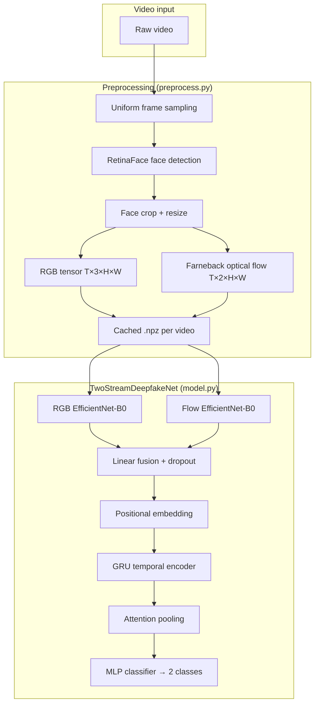
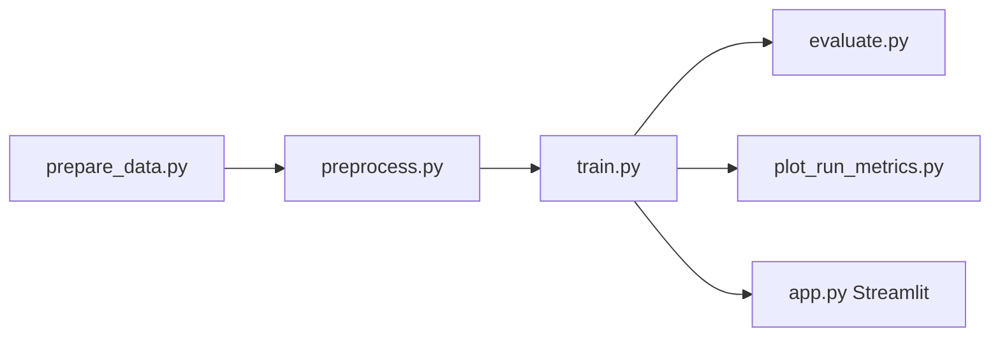

# Deepfake CPU Two-Stream Detector

A **CPU-first** deep learning pipeline for **video deepfake detection** on the [FaceForensics++ (C23)](https://www.kaggle.com/datasets/xdxd003/ff-c23) dataset. The model uses a **two-stream architecture**: one stream encodes aligned face **RGB** frames, the other encodes **optical flow** between consecutive frames. Temporal patterns are modeled with a **GRU** and **attention pooling**, then a classifier outputs **real vs. fake**.

Designed for machines without a GPU: training, evaluation, and the Streamlit demo all run on **CPU**.

---

## Table of contents

- [Features](#features)
- [Architecture](#architecture)
- [Project structure](#project-structure)
- [Data pipeline](#data-pipeline)
- [Requirements](#requirements)
- [Installation](#installation)
- [Quick start](#quick-start)
- [Running each stage](#running-each-stage)
- [Configuration reference](#configuration-reference)
- [Outputs and artifacts](#outputs-and-artifacts)
- [Streamlit demo](#streamlit-demo)
- [Design notes and limitations](#design-notes-and-limitations)
- [License and dataset](#license-and-dataset)

---

## Features

| Area | Description |
|------|-------------|
| **Two-stream model** | Separate EfficientNet-B0 encoders for RGB (3ch) and optical flow (2ch) |
| **Temporal modeling** | Frame-level fusion → positional embeddings → GRU → attention-weighted clip representation |
| **End-to-end pipeline** | Download & sample data → preprocess videos → train → evaluate → optional UI |
| **CPU training** | No CUDA dependency; suitable for laptops and CI |
| **Preprocessing cache** | Hashed `.npz` files with manifest to avoid reprocessing unchanged videos |
| **Training options** | Focal loss, label smoothing, gradient accumulation, cosine warmup, early stopping, optional backbone freeze |
| **Evaluation** | Test-set metrics, ROC curve, confusion matrix, optional threshold tuning on validation |
| **Streamlit app** | Upload a video and get a real/fake prediction with optional debug artifacts |

---

## Architecture

### High-level flow



### Model diagram (per clip)

For each video clip with `T` frames:

1. **RGB stream** — `EfficientNetEncoder(in_channels=3)` maps each frame to a 1280-d embedding.
2. **Flow stream** — `EfficientNetEncoder(in_channels=2)` maps each 2-channel flow map (dx, dy) to a 1280-d embedding.
3. **Fusion** — Concatenate RGB + flow features → linear layer (2560 → `fusion_dim`, default 512) + ReLU + dropout.
4. **Temporal** — Add learned positional embeddings (max `max_frames`, default 32), run a single-layer **GRU** (`temporal_hidden_dim`, default 256).
5. **Pooling** — Softmax attention over time steps to get one vector per clip.
6. **Classifier** — Linear → ReLU → dropout → linear → **2 logits** (real=0, fake=1).

```text
rgb [B,T,3,H,W]  ──► RGB Encoder ──► [B,T,1280] ──┐
                                                  ├──► fuse ──► +pos ──► GRU ──► attn ──► classifier
flow [B,T,2,H,W] ──► Flow Encoder ──► [B,T,1280] ─┘
```

### Optical flow

Between consecutive aligned face crops, **Farneback** dense optical flow is computed. Only **dx** and **dy** are kept, clipped to ±20, and scaled to **[-1, 1]** (stored as `float16` in cache). The first frame uses zero flow.

### Why two streams?

- **RGB** captures appearance artifacts (texture, blending, color).
- **Flow** captures temporal inconsistency and unnatural motion between frames.
- Fusing both before temporal aggregation is a standard approach in video forensics and helps when either cue alone is weak.

---

## Project structure

```text
deepfake-cpu-two-stream/
├── run_pipeline.py          # Orchestrates prepare → preprocess → train
├── requirements.txt         # Core Python dependencies
├── README.md
├── data/
│   ├── raw/                 # Reserved for local raw data (Kaggle cache is external)
│   ├── splits/              # CSV splits (train / val / test)
│   └── processed/           # Cached .npz + hash_manifest.json
├── outputs/
│   ├── runs/                # Training runs (config, history, best_model.pt, plots)
│   └── ui_artifacts/        # Optional Streamlit debug images
└── src/
    ├── prepare_data.py      # Download FF-C23, audit, sample, split
    ├── preprocess.py        # Face align, flow, write .npz cache
    ├── dataset.py           # PyTorch Dataset (load .npz, augment, normalize)
    ├── model.py             # TwoStreamDeepfakeNet + EfficientNetEncoder
    ├── train.py             # Training loop (CPU)
    ├── evaluate.py          # Test metrics + plots
    ├── plot_run_metrics.py  # Plot history + train/val confusion/ROC for a run
    └── app.py               # Streamlit inference UI
```

---

## Data pipeline

### 1. Prepare (`prepare_data.py`)

- Downloads **FaceForensics++ C23** via [`kagglehub`](https://github.com/Kaggle/kagglehub) (`xdxd003/ff-c23`).
- Scans all videos and infers **real** vs **fake** from path segments (`original`, `real`, etc.).
- **Balanced sampling**:
  - Top **5** fake manipulation groups (by count).
  - Up to `--fake-per-group` fakes per group (default 400).
  - Up to `--target-real` real videos (default 1600).
- **Stratified split** (by label): 70% train / 15% val / 15% test.
- Writes `data/splits/train.csv`, `val.csv`, `test.csv`, `all_splits.csv`, and `audit_all_videos.csv`.

### 2. Preprocess (`preprocess.py`)

For each video in the split CSV:

1. Sample `--num-frames` frames uniformly across the video.
2. Detect the dominant face on the first frame (**RetinaFace**, on a downscaled frame).
3. Crop all frames with padding, resize to `--image-size` (default 224).
4. Build RGB stack and pairwise optical flow.
5. Save compressed **`{hash}.npz`** under `data/processed/` with keys: `rgb`, `flow`, `label`.
6. Re-split successfully processed videos and write **`all_splits_processed.csv`**.

Preprocessing is **skipped** when a matching cached `.npz` exists (config-aware hash in `hash_manifest.json`).

### 3. Train / evaluate

- Training reads `all_splits_processed.csv` and loads tensors from `npz_path`.
- RGB is normalized with **ImageNet** mean/std; flow is used as stored (already normalized).
- Training augmentations (RGB): flip, rotation, color jitter, noise, blur, compression simulation.
- Flow augmentations: horizontal flip with **dx sign flip** only.

---

## Requirements

### Python

- **Python 3.10+** recommended (project tested with 3.12).

### Core dependencies (`requirements.txt`)

| Package | Role |
|---------|------|
| `torch`, `torchvision` | Model, training, inference |
| `opencv-python` | Video I/O, optical flow, image ops |
| `numpy`, `pandas` | Data handling |
| `scikit-learn` | Metrics, splits |
| `matplotlib`, `seaborn` | Plots |
| `tqdm` | Progress bars |
| `kagglehub` | Dataset download |
| `streamlit` | Web UI |

### Additional (preprocessing & UI)

Face detection requires **RetinaFace** (not listed in `requirements.txt`):

```bash
pip install retina-face
```

You also need a **Kaggle account** and credentials configured for `kagglehub` to download the dataset (see [Kaggle API setup](https://github.com/Kaggle/kaggle-api#api-credentials)).

---

## Installation

```bash
git clone <your-repo-url>
cd deepfake-cpu-two-stream

python -m venv .venv

# Windows
.venv\Scripts\activate

# Linux / macOS
source .venv/bin/activate

pip install -r requirements.txt
pip install retina-face
```

---

## Quick start

Run the full pipeline (download → preprocess → train):

```bash
python run_pipeline.py --pretrained
```

This uses defaults tuned for CPU (small batch size, gradient accumulation). Expect preprocessing to take a long time on CPU due to face detection per video.

After training completes:

```bash
python src/evaluate.py --model-path outputs/runs/<timestamp>/best_model.pt --tune-threshold
python src/plot_run_metrics.py
```

---

## Running each stage

### Full pipeline (`run_pipeline.py`)

```bash
python run_pipeline.py [options]
```

| Flag | Default | Description |
|------|---------|-------------|
| `--skip-prepare` | off | Skip dataset download and CSV creation |
| `--skip-preprocess` | off | Skip video preprocessing |
| `--processed-csv` | `data/splits/all_splits_processed.csv` | Override processed manifest |
| `--pretrained` | off | ImageNet weights for EfficientNet backbones |
| `--balanced-sampler` | off | Class-balanced sampling each epoch |
| `--epochs` | 30 | Max training epochs |
| `--batch-size` | 2 | Batch size (CPU-friendly) |
| `--accum-steps` | 4 | Gradient accumulation steps |
| `--num-frames` | 12 | Frames extracted per video in preprocess |
| `--fake-per-group` | 400 | Fakes sampled per manipulation group |
| `--target-real` | 1600 | Max real videos to include |

### Prepare only

```bash
python src/prepare_data.py --out-dir data --seed 42 --fake-per-group 400 --target-real 1600
```

### Preprocess only

```bash
python src/preprocess.py --split-csv data/splits/all_splits.csv --out-dir data/processed --num-frames 12 --image-size 224
```

### Train only

```bash
python src/train.py --processed-csv data/splits/all_splits_processed.csv --pretrained --monitor-metric auc
```

### Evaluate on test set

```bash
python src/evaluate.py --model-path outputs/runs/<run_id>/best_model.pt --tune-threshold
```

### Plot training curves for latest run

```bash
python src/plot_run_metrics.py
# or a specific run:
python src/plot_run_metrics.py --run-dir outputs/runs/<run_id>
```

---

## Configuration reference

### Training (`train.py` / `run_pipeline.py`)

| Parameter | Default | Notes |
|-----------|---------|-------|
| `monitor_metric` | `auc` | Early stopping and best checkpoint (`accuracy`, `auc`, `f1`) |
| `loss_type` | `ce` | `ce` or `focal` |
| `label_smoothing` | 0.05 | Cross-entropy smoothing |
| `grad_clip_norm` | 5.0 | Gradient clipping |
| `scheduler` | `cosine` | `cosine` (with warmup) or `plateau` |
| `freeze_epochs` | 0 | Freeze both encoders for N epochs, then fine-tune all |
| `dropout` | 0.3 | Fusion and classifier dropout |
| `fusion_dim` | 512 | Fused frame embedding size |
| `temporal_hidden_dim` | 256 | GRU hidden size |
| `max_frames` | 32 | Must be ≥ frames per clip in data |
| `patience` | 10 | Early stopping patience |

**Device:** training and evaluation are fixed to **`device = "cpu"`** in code.

### Labels

| `label_id` | Meaning |
|------------|---------|
| 0 | Real |
| 1 | Fake |

---

## Outputs and artifacts

### Training run (`outputs/runs/<YYYYMMDD_HHMMSS>/`)

| File | Description |
|------|-------------|
| `config.json` | All CLI arguments used for the run |
| `history.json` | Per-epoch train/val metrics |
| `best_model.pt` | Best checkpoint by `monitor_metric` |
| `metrics_over_epochs_*.png` | Loss, accuracy, F1, AUC curves (via `plot_run_metrics.py`) |
| `confusion_matrix_train.png`, `confusion_matrix_val.png` | Split confusion matrices |
| `roc_curve_train_val.png` | Train vs val ROC |
| `split_metrics.json` | AUC and confusion matrix summaries |

### Evaluation run (`outputs/runs/<timestamp>_eval/`)

| File | Description |
|------|-------------|
| `metrics.json` | AUC, accuracy, threshold, classification report |
| `confusion_matrix.png` | Test set confusion matrix |
| `roc_curve.png` | Test set ROC |

### Processed data (`data/processed/`)

| File | Description |
|------|-------------|
| `<hash>.npz` | `rgb`, `flow`, `label` arrays |
| `hash_manifest.json` | Maps short hash → video path + preprocess signature |

---

## Streamlit demo

Launch the interactive detector:

```bash
streamlit run src/app.py
```

**Sidebar settings:**

- Path to `best_model.pt`
- Decision threshold (default 0.5)
- Frames per video and crop size (should match training preprocess when possible)
- `max_frames` must match the value used when the checkpoint was trained
- Optional save of sampled frames, face crops, and flow visualizations under `outputs/ui_artifacts/`

The app reuses `process_one_video` from `preprocess.py` so inference preprocessing matches the training pipeline.

---

## Design notes and limitations

1. **CPU only** — No mixed-precision or GPU path; large datasets and many epochs will be slow.
2. **FaceForensics++ C23** — Model quality depends on dataset diversity; performance on out-of-distribution manipulations or platforms is not guaranteed.
3. **Single-face assumption** — One face box from the first frame is applied to all sampled frames.
4. **RetinaFace dependency** — Preprocessing fails without `retina-face`; install it explicitly.
5. **Class imbalance** — Default sampling favors many fake groups; use `--balanced-sampler` and weighted / focal loss if metrics skew toward one class.
6. **Checkpoint compatibility** — `max_frames`, `fusion_dim`, and `temporal_hidden_dim` must match between training and inference when loading `state_dict`.
7. **Kaggle download** — First run needs network access and valid Kaggle credentials; dataset size is large.

---

## License and dataset

- **Code in this repository:** add your license here if you publish the repo.
- **FaceForensics++:** subject to the dataset’s [terms of use](https://github.com/ondyari/FaceForensics); access via Kaggle requires agreeing to Kaggle’s dataset license.

When citing this work, reference FaceForensics++ and describe the two-stream EfficientNet + GRU + attention architecture used in `src/model.py`.

---

## Typical workflow (summary)



```bash
# 1) One-shot
python run_pipeline.py --pretrained

# 2) Test + plots
python src/evaluate.py --model-path outputs/runs/<run>/best_model.pt --tune-threshold
python src/plot_run_metrics.py --run-dir outputs/runs/<run>

# 3) Demo
streamlit run src/app.py
```

For questions or improvements, open an issue or PR in your repository tracker.
